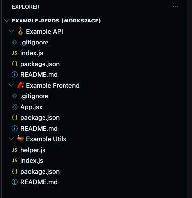

# vscode-workspace-emojifier

Simple bash script to add random emojis to folder names in a Visual Studio Code workspace file for better visual organization.

## Install

```bash
curl -o ~/.local/bin/workspace-add-emoji https://raw.githubusercontent.com/partly-cloud/vscode-workspace-emojifier/main/workspace-add-emoji.sh && chmod +x ~/.local/bin/workspace-add-emoji
```

Make sure `~/.local/bin` is in your `PATH`.

## Usage

From any repo that's part of a workspace, just run:

```bash
workspace-add-emoji
```

The script auto-discovers `.code-workspace` files in the current or parent directory. If multiple are found, it prompts you to pick one.

You can also specify a workspace file explicitly:

```bash
workspace-add-emoji --workspace <path-to-workspace.code-workspace>
```

Or use the short flag:

```bash
workspace-add-emoji -w <path-to-workspace.code-workspace>
```

## Example

```bash
workspace-add-emoji -w my-workspace.code-workspace
# Updated 5 folders in my-workspace.code-workspace
```

The script will randomly assign emojis to each folder and update the workspace file in-place.

## Example Output


